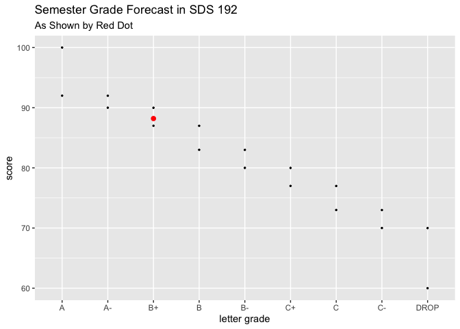

Demystify the Semester with the SDS 192 Grade Calculator
================

## The Calculator

Replace the random values in the tibble variable “scores” with your actual
data and make predictions for future grades.

``` r
library(tidyverse)
```

    ## ── Attaching packages ─────────────────────────────────────── tidyverse 1.3.1 ──

    ## ✓ ggplot2 3.3.5     ✓ purrr   0.3.4
    ## ✓ tibble  3.1.5     ✓ dplyr   1.0.7
    ## ✓ tidyr   1.1.4     ✓ stringr 1.4.0
    ## ✓ readr   2.0.2     ✓ forcats 0.5.1

    ## ── Conflicts ────────────────────────────────────────── tidyverse_conflicts() ──
    ## x dplyr::filter() masks stats::filter()
    ## x dplyr::lag()    masks stats::lag()

``` r
#build the calculator and input your data in "scores"
SDS_grades <- tibble(
  coursework = c("MT1", "MT2", "MP1", "MP2", "MP3", "FP", "Pset", "ENGMNT"),
  weight = c(0.15, 0.20, 0.05, 0.10, 0.15, 0.20, 0.10, 0.05),
  scores = c(80, 95, 100, 90, 78, 90, 85, 100)) %>%
  summarize(sem_grade= sum(weight * scores)) %>%
  mutate(letter_grade= ifelse(sem_grade>92,"A",
                              ifelse(sem_grade<=92 & sem_grade>=90, "A-",
                                     ifelse(sem_grade<90 & sem_grade>=87, "B+",
                                            ifelse(sem_grade<87 & sem_grade>=83, "B",
                                                   ifelse(sem_grade<83 & sem_grade>=80, "B-",
                                                          ifelse(sem_grade<80 & sem_grade>=77, "C+",
                                                                 ifelse(sem_grade<77 & sem_grade>=73, "C",
                                                                    ifelse(sem_grade<73 & sem_grade>=70, "C-",
                                                                    ifelse(sem_grade<70 & sem_grade>=50, "DROP SDS 192"))))))))))

SDS_grades
```

    ## # A tibble: 1 × 2
    ##   sem_grade letter_grade
    ##       <dbl> <chr>       
    ## 1      88.2 B+

## See How You Stack Up

<!-- -->
